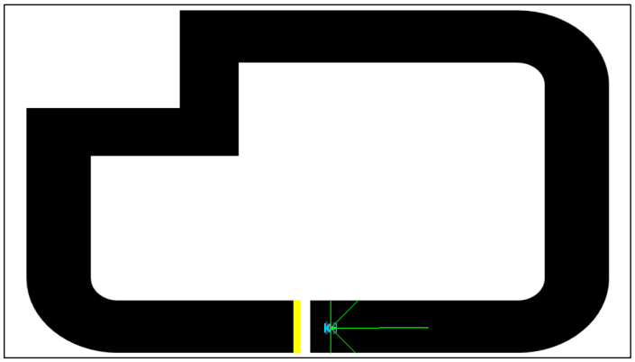
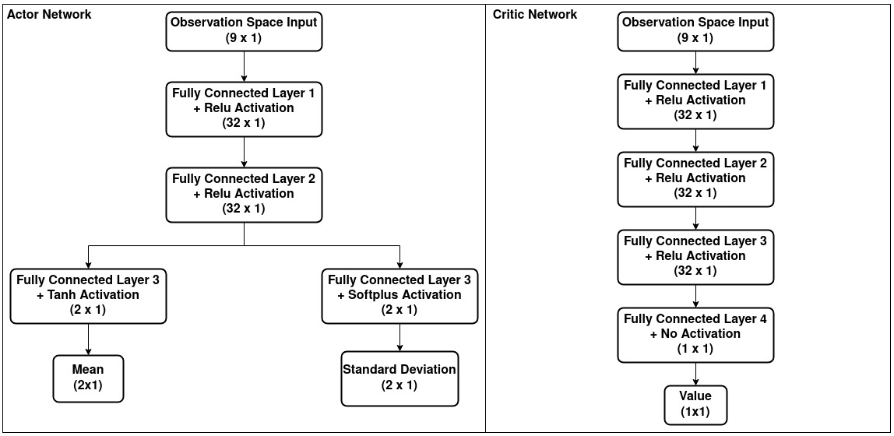
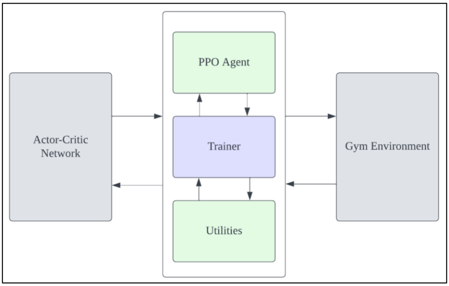
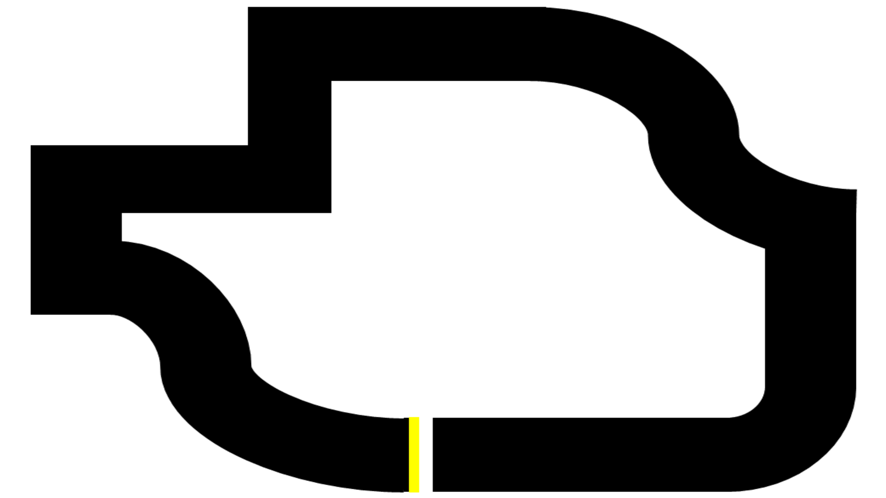
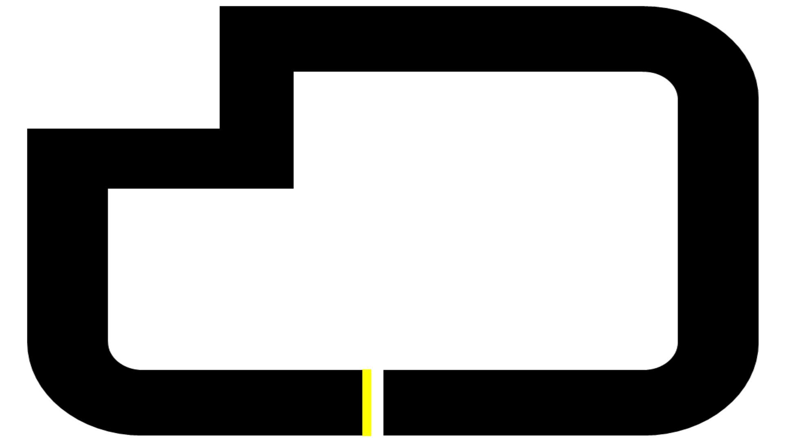

# Deep Reinforcement Learning for Autonomous Racing

## Overview :

The goal of this project was to develop a Deep Reinforcement Learning based model for an autonomous racing vehicle to dynamically determine the optimal race line on a track and minimize the lap times. The Policy Proximal Optimization (PPO) algorithm was chosen for this project for its stability in training continuous observation and action spaces.

Figure 1: Agent (Vehicle) on the track. Yellow line represents the finish line. Green lines represent sparse lidar scans.

### Simulation :

The vehicle simulator was built and rendered using pygame library and was converted to an OpenAI gym environment to standardize the framework and maintain consistency.

### RL Cast :

- **State Space:** Continuous State Space. Defines agent's x and y co-ordinates in the global frame, agent's pose (yaw) and velocity (speed) in the local frame, and five sparse lidar scans spanning from -90 to +90 degrees.

- **Action Space:** Continuous Action Space. Consists of vehicle's steer angle and acceleration / deceleration.

- **Reward Structure:** 
    - A reward of +0.001 is given for every time step in the simulation.
    - A reward of +0.1 x speed is given for every time step in simulation.
    - A reward of +50 is given evry time agent completes 50 steps in the simulation.
    - A reward of +500 is given on completion of the lap.
    - An additional reward of +100 is given if agent finishes the lap faster than its previous fastest lap time.

### Network Structure :

An Actor-Critic Network structure was used for this project. The Actor Network produces the 'Mean action' and the 'Standard Deviation' for the Guassian distribution from which the actions are sampled. The Critic Network estimates the 'State Value' Function.

Figure 2: Actor-Critic Network 

### Learning Agent :

The Proximal Policy Optimization (PPO) agent was used for this project. PPO is inherently exploratory and generates stochastic policies. Moreover, PPO clips the objectove function values which helps prevent large policy updates and ensures smooth convergence.

Figure 3: RL stack pipeline

### Training :

The agent was trained on **Map3**. Subsequently, the trained model was then tested on **Map3** as well as on an unseen map **Map1**.

Figure 4: Map3. Used for training and testing the agent.

Figure 5: Map1. Used for testing the trained agent.

## Contents :

This repository contains the following:

   1. PPO_Agent.py
   2. Gym_new.py
   3. ACNet.py
   4. Utilities.py
   5. trainer.ipynb
   6. requirements.txt
   7. car.png
   8. map1a.png
   9. map3.png
  10. models/
  11. new_models/
  12. imgs/
  14. Report.pdf
  15. videos/

**PPO_Agent.py** contains the code for the agent. The agent interacts with gym environment in **Gym_new.py**, gets the observations and passes those to the Actor-Critic Network in **ACNet.py** to generate actions and the State Value Function. **Utilities.py** conatins the helper functions.

The **trainer.ipynb** file contains the code to set up the training parameters to train the agent, save the trained model and use it to test and evaluate the agent's performance.

A trained model has already been saved in the **models/** folder. The **videos/** folder contains the videos of the trained agent interacting with the environment (both the tracks in this case). The folder also contains a compariosn video between our PPO agent and Stablebaselines3's PPO agent.

 
## Dependencies :

* System Requirements :
    * Ubuntu 20.04 (Windows not yet tested)
    * Python 3.8.18 (Other python version not yet tested)
* This repo depends on the following standard python packages and libraries:
    * `tensorflow==2.13.1`
    * `numpy==1.22.1`
    * `gym`
    * `pyglet`
    * `imageio`
    * `matplotlib`
    * `scipy`
    * `jupyter`
    * `tensorflow-probability`

**Note:** Make sure the system requirements are met and all the dependencies are installed correctly.

## Usage :

You may begin by creating a conda environment according to the requirements listed in **requirements.txt** file. You may also run the program locally without needing to create conda environment by installing all the dependencies correctly. (Although, Running the code in conda environment is recommended)

Run the **trainer.ipynb** notebook file to either train the agent or use a trained model to test the agent on the provided maps. Maps can be changed from within the notebook file. In the cell 3 of the notbook file, set the parameter `train=True` for training the agent. The optimal weights during training will be saved in **new_models/** folder.

## Summary : 

Post training, the trained model was evaluated on a different map (Map1), not encountered during training. The model performed extremely well on the map it wasn't trained on which attested our objective of generalizing the system. 

A detailed explaination about the training process and results can be found in the inlcuded report.